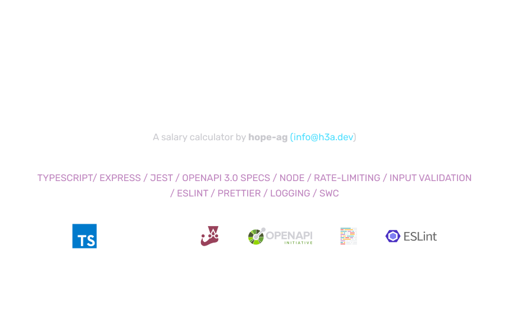
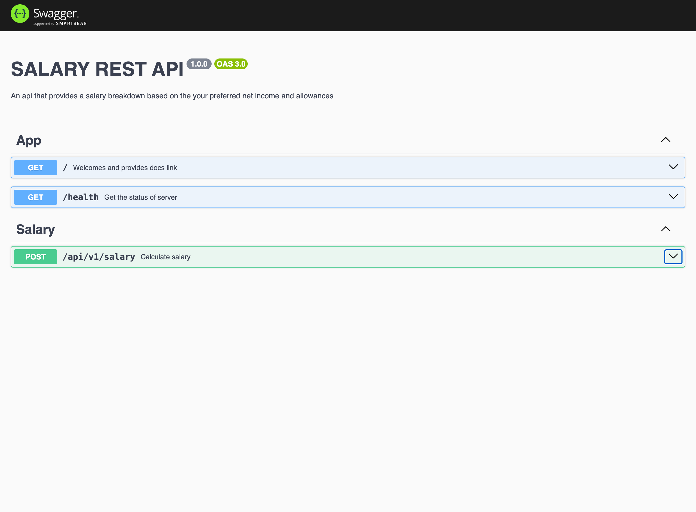

<p align='center'>
  
</p>

<p align='center'>
  API Docs<sup><em>(OpenAPI 3.0)</em></sup><br>
</p>

<br>

Provide your expected net income and allowances and get a detailed breakdown of your gross income, taxes, and social security contributions, based on GRA's latest tax rates.

<br>
<p align='center'>
  
</p>
<br>

## Features

- ⚡️ [Express JS](https://expressjs.com), [SWC](https://swc.rs), [ESLint](https://eslint.org/), [Prettier](https://prettier.io/)

- 🦾 TypeScript

- OpenAPI 3.0 [API Documentation](https://swagger.io/docs/specification/api-documentation/)

## Starting the project

### Prerequisites

- [NodeJS](https://nodejs.org) - Tested on version 20.11.0 and NPM version 10.2.4


### Steps

1.  Clone the github project . This will create a `gra-test` folder in your current directory. Open it in your preferred text editor or IDE.
```bash
git clone git@github.com:hope-ag/gra-tax.git

cd gra-tax
```

2. Create a copy of [`env.example`](./env.example) and rename it to .env. Open the new [`.env`](./.env) and replace the `PORT` with your preferred port.

<br>

3. Open a terminal and install the project dependencies:
```bash
# npm
npm i

# pnpm
pnpm i

# yarn
yarn
```

4. Run the project in development mode:
 ```bash
 # npm
 npm run dev

 # pnpm
 pnpm run dev

 # yarn
 yarn dev
 ```

 <br>
 <br>
 <br>


Refer to the [package.json](./package.json) for more details on testing, building and serving.
